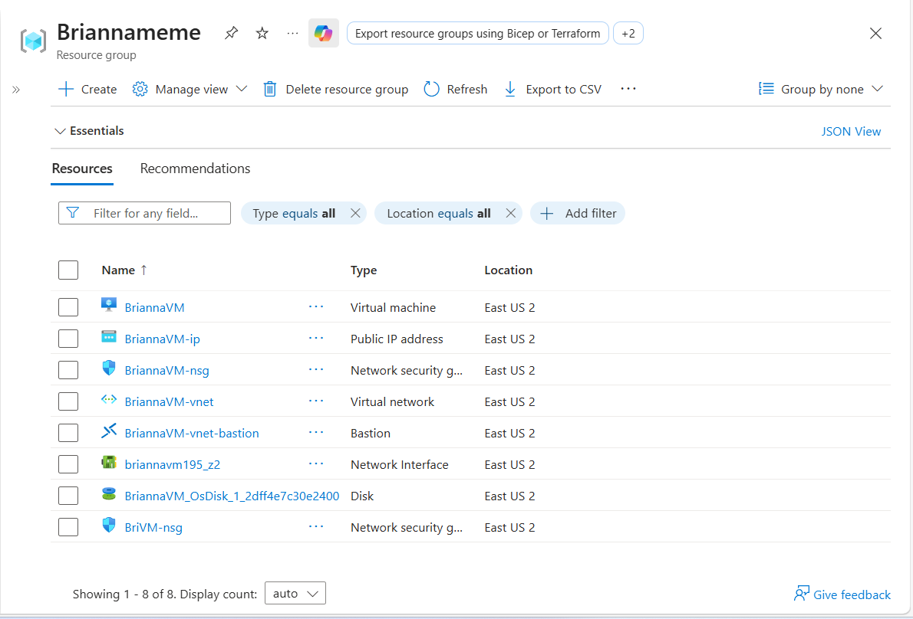
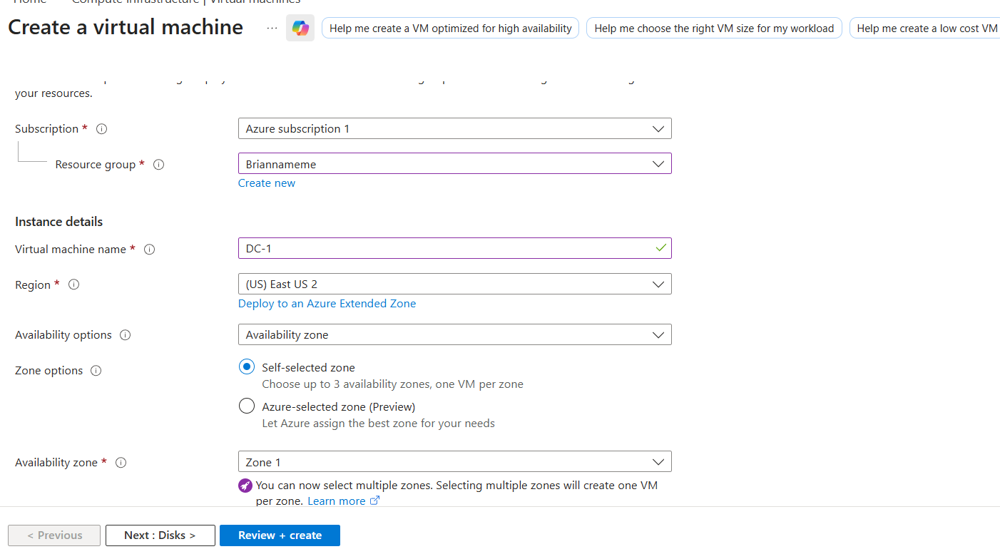
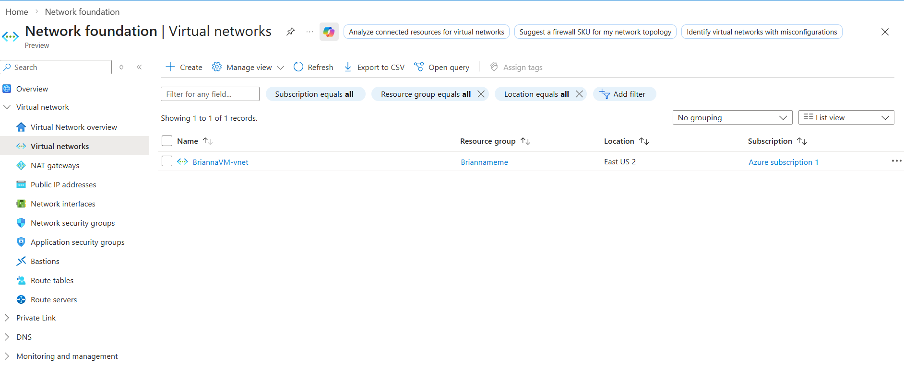
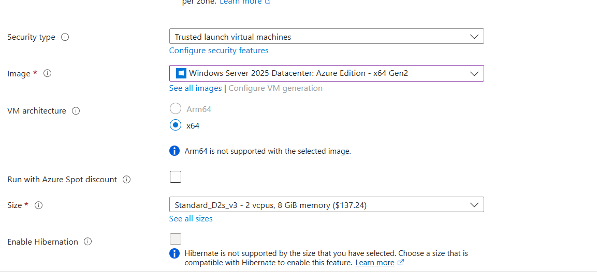
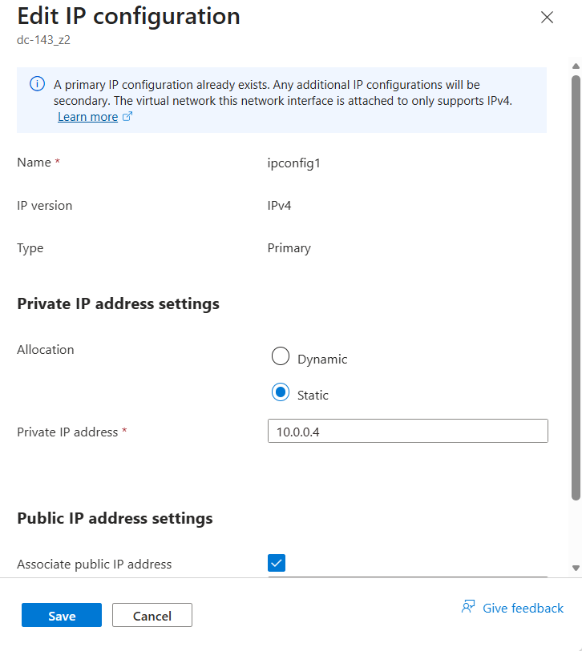
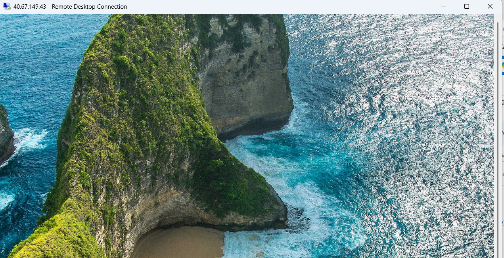
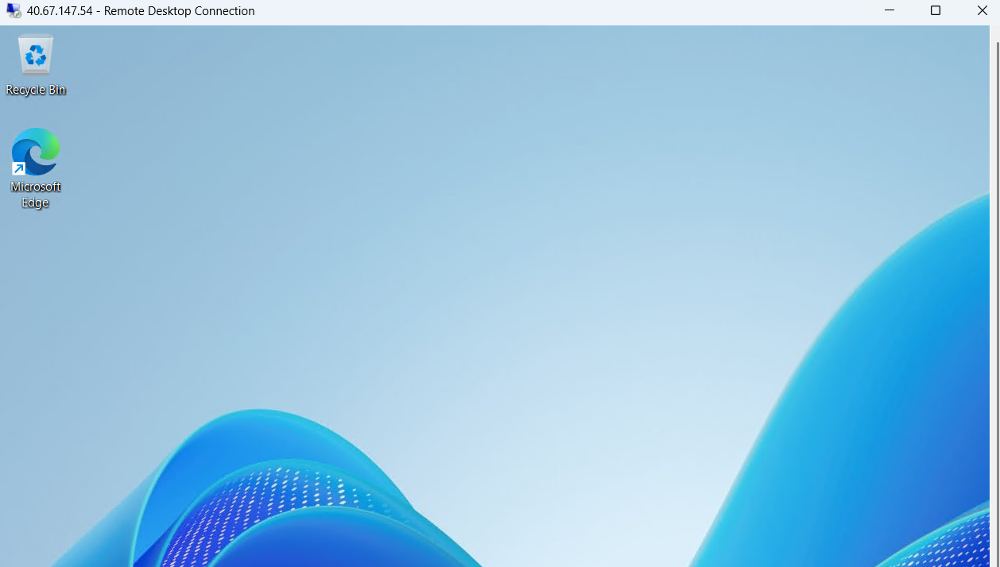
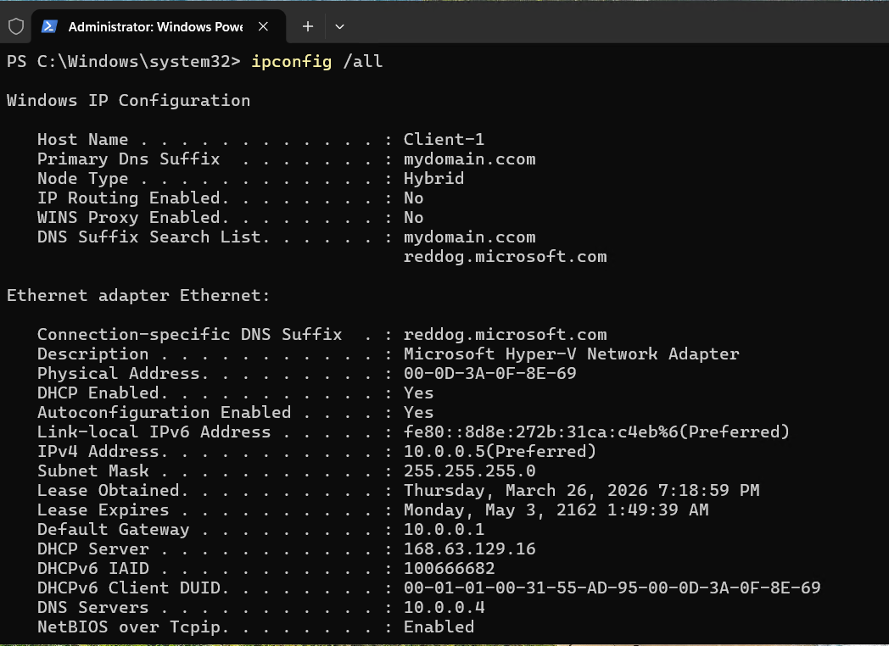

# Active Directory Infrastructure in Microsoft Azure  
This project demonstrates how to deploy a basic Active Directory environment in Microsoft Azure by creating a Domain Controller (DC-1) using Windows Server 2025 Datacenter and a client machine (Client-1). The setup includes configuring networking, assigning a static IP, installing Active Directory Domain Services, and validating connectivity between systems.  

## Steps Taken  
1. Created a Resource Group and Virtual Network in Microsoft Azure to organize and connect all resources  
2. Set the Domain Controller’s private IP address to static to ensure reliable communication and DNS functionality  
3. Used Remote Desktop Connection to securely connect to both DC-1 and Client-1 using their respective IP addresses  
4. Configured Client-1 DNS settings to point to DC-1 and ensured both machines were on the same network  
5. Verified connectivity by running `ipconfig /all` in PowerShell on Client-1 to confirm it was connected to the Domain Controller and using the correct DNS settings   

  

-

---
